## 200407 멋사 1주차 개발 자료
수업 방식은 기초부터 하되 빠르게 나갈것이고 본인의 노력이 필요할 것 
<br/>
- 1 REPL을 이용한 Naver Clone Coding
- 2 Django Framework를 사용하는 이유
- 3 웹 구동 원리와 Django의 역활
- 3 환경설정, 패키지설치, Django Hello World!
- 4 Github : 분산 버전 관리 툴인 깃을 사용하는 프로젝트를 지원하는 웹호스팅 서비스
> 과제1 : django 에서 css 어떻게 연결하는지 구글링해서 혼자 해보기<br/>
> 과제2 : repl에 한거 좀 더 수정해서 django에서 runserver 돌린 결과물 자랑하기


### 1 REPL을 이용한 Naver Clone coding
- 1 ) REPL이 뭔데?
> REPL(read-eval-print loop) 은 단일 사용자의 입력(예: 단일 식)을 취하고<br/>
이를 평가(실행)하고 결과를 사용자에게 반환시키는 단순한 상호작용 컴퓨터 프로그래밍 환경이다.<br/><br/>
`무슨말인지 모르겠으니 그냥 들어가보죠`<br/><br/>
[REPL 사이트 링크](https://repl.it/) <br/><br/>
로그인을하고 New Repl 생성하면 다음과 같이 나타납니다<br/><br/>
<br/><br/>
아하 코드카데미처럼 내 코드를 바로 보여주는 거라는 걸 알 수 있죠?<br/>
<br/>

- 그럼 이제 배운 html과 css를 가지고 Naver 페이지가 어떻게 만들어졌는지 알아봅시다.<br/>
> 네이버도 사람이 만든거니 코드가 있겠죠? 키보드에 F12 를 누르면 개발자 코드를 볼 수 있습니다<br/>
<br/><br/>
누가 주석도 달았고 Header 태그도 확인할 수 있군요<br/><br/>
추가적으로 좌측에 동그라미 친 inspection 도구를 클릭하고 페이지에 커서를 가져가면<br/>
페이지에 나타난 것이 어떤 코드로 되어있는지 확인할 수 있습니다<br/><br/>
<br/><br/>
네이버의 페이지 구성을 보면 크게 `<header>, <content>, <Footer>`태그로 로 이루어진 것을 알 수 있어요<br/><br/>


<br/><br/>
<p>그러면 이제 한번 따라 해볼게요!</p>
  
- 2 ) Naver Clone Coding
>먼저 html 태그를 나누고 css로 태그별로 구분을 해주겠습니다
<br/>

```html
<!-- html -->

<body>
   <div class = "header">
      <h2>여기가 헤더</h2>
    </div>
    <div class = "content">
      <h2>여기가 메인</h2>
    </div>
    <div class = "footer">
      <h2>여기가 푸터</h2>
    </div>
</body>
```

```css
// CSS

.header{
  background-color:beige;
}

.content{
  background-color:yellow;
}

.footer{
  background-color:gray;
} 
```

그런데 이렇게 해주면 태그별로 위치 구분이 안가죠?<br/>
html 태그와 css 처리를 좀 해주겠습니다<br/>

```html
<!-- html -->

<body>

    <div class = "container">

      <div class = "header">
        <h2>여기가 헤더</h2>
      </div>
      
      <div class = "content">
        <h2>여기가 메인</h2>
      </div>

      <div class = "footer">
        <h2>여기가 푸터</h2>
      </div>

    </div>

  </body>
```

```css
// CSS

.container {
  display : grid;
  position : relative;
  margin : auto;
  grid-template-areas: "header"
                       "content"
                       "footer";
  grid-template-rows: 2fr 6fr 2fr;
  height : 700px;
  
}

.header{
  background-color:beige;
  text-align : center;
  padding : 50px 0px 0px 0px;
}

.content{
  background-color:yellow;
  text-align : center;
  padding : 200px 0px 0px 0px;
}

.footer{
  background-color:gray;
  text-align : center;
  padding : 50px 0px 0px 0px;
} 
```

<br/>


<br/><br/>
`이제 뭔가 그럴싸 하쥬?`<br/>
다시 네이버 페이지를 가볼게요 무엇이 더 필요할까요?<br/>
<br/><br/>
보니까 헤더태그 안에 메일, 카페, 블로그등으로 이동할 수 있는 Navigation 이 있고<br/>
main content 태그에는 로그인, 광고, 기사들을 포함한 다양한 박스들이 있네요<br/>
한번 따라해보죠<br/>

```html
<!-- html -->

  <body>

    <div class = "container">

      <div class = "header">
        <div class = "header_top">
          네이버 클론코딩
        </div>
        <div class = "header_bottom">
          네비게이션들
        </div>
      </div>
      
      <div class = "content">
        <div class = "content_left">
          광고랑 기사 넣어
        </div>
        <div class = "content_right">
          로그인 form이랑 여러가지 넣어
        </div>
      </div>

      <div class = "footer">
        <h2>여기가 푸터</h2>
      </div>

    </div>

  </body>
```

```css
// css

.container {
  display : grid;
  position : relative;
  margin : auto;
  grid-template-areas: "header"
                       "content"
                       "footer";
  grid-template-rows: 1.5fr 6fr 2fr;
  height : 1200px;
  
}

.header{
  display : grid;
  position : relative;
  text-align : center;
  grid-template-areas: "header_top"
                       "header_bottom";
  grid-template-rows: 3fr 1fr;
}

.header_top{
  background-color: white;
  color : black;
  padding-top : 30px;
  font-size : 50px;
}

.header_bottom{
  background-color:rgb(80, 190, 70);
  padding-top : 10px;
  font-size : 20px;
}

.content{
  background-color:rgba(128, 128, 128, 0.37);
  text-align : center;
  padding : 20px 0px 20px 0px;
  position : relative;
  z-index : 0;
  font-size : 20px;
}

.content_left{
  background-color:white;
  text-align : center;
  display : inline-block; /* block 은 상하정렬 해주고 크기 조절을 위해 inline을 추가한다.*/
  position : relative;
  padding : 200px 0px 20px 0px;
  width : 700px;
  height : 700px;
}

.content_right{
  background-color:white;
  text-align : center;
  display : inline-block;
  position : relative;
  padding : 200px 0px 20px 0px;
  width : 300px;
  height : 700px;
}

.footer{
  background-color:gray;
  text-align : center;
  padding : 50px 0px 0px 0px;
} 
```

<br/><br/>
네비게이션이랑 박스들 좀 더 추가해주면!

```html
<!-- html -->

  <!-- body 부분 -->
  <body>

    <div class = "container">

      <div class = "header">
        <div class = "header_top">
          네이버 클론코딩
        </div>
        <div class = "header_bottom">
          <div class = "navi">호연</div>
          <div class = "navi">재환</div>
          <div class = "navi">광일</div>
          <div class = "navi">승욱</div>
          <div class = "navi">규리</div>
          <div class = "navi">수훈</div>
          <div class = "navi">주연</div>
          <div class = "navi">유림</div>
          <div class = "navi">소연</div>
          <div class = "navi">영윤</div>
        </div>
      </div>
      
      <div class = "content">
        <div class = "content_left">
          <div class = "left_box1">
            광고
          </div>
          <div class = "left_box2">
            기사
          </div>
          <div class = "left_box3">
          </div>
        </div>
        <div class = "content_right">
          <div class = "right_box1">
            로그인
          </div>
          <div class = "right_box2">
            그 외 것들
          </div>
          <div class = "right_box3">
          </div>
        </div>
      </div>

      <div class = "footer">
        <h2>여기가 푸터</h2>
      </div>

    </div>

  </body>
```

```css
/*css*/

.container {
  display : grid;
  position : relative;
  margin : auto;
  grid-template-areas: "header"
                       "content"
                       "footer";
  grid-template-rows: 1.5fr 6fr 2fr;
  height : 1200px;
  
}

.header{
  display : grid;
  position : relative;
  text-align : center;
  grid-template-areas: "header_top"
                       "header_bottom";
  grid-template-rows: 3fr 1fr;
}

.header_top{
  background-color: white;
  color : black;
  padding-top : 30px;
  font-size : 50px;
}

.header_bottom{
  background-color:rgb(80, 190, 70);
  padding-top : 10px;
  font-size : 20px;
}

.navi{
  padding-top : 5px;
  font-size : 20px;
  display : inline-block;
  text-align : center;
  width : 80px;
  height : 30px;
  border : 1px solid grey;
}

.content{
  background-color:rgba(128, 128, 128, 0.37);
  text-align : center;
  padding : 20px 0px 20px 0px;
  position : relative;
  z-index : 0;
  font-size : 20px;
}

.content_left{
  background-color:white;
  text-align : center;
  display : inline-block; /* block 은 상하정렬 해주고 크기 조절을 위해 inline을 추가한다.*/
  position : relative;
  padding : 20px 0px 20px 0px;
  width : 700px;
  height : 700px;
}

.content_right{
  background-color:white;
  text-align : center;
  display : inline-block;
  position : relative;
  padding : 20px 0px 20px 0px;
  width : 300px;
  height : 700px;
}

.left_box1{
  background-color:rgba(189, 67, 67, 0.459);
  text-align : center;
  display : inline-block; /* block 은 상하정렬 해주고 크기 조절을 위해 inline을 추가한다.*/
  position : relative;
  padding : 90px 0px 0px 0px;
  margin: 10px 0px 10px 0px;
  width : 600px;
  height : 150px;
  box-shadow: 5px 5px rgba(0, 0, 0, 0.11);
}

.left_box2{
  background-color:rgb(67, 189, 189);
  text-align : center;
  display : inline-block; /* block 은 상하정렬 해주고 크기 조절을 위해 inline을 추가한다.*/
  position : relative;
  padding : 10px 0px 20px 0px;
  margin: 10px 0px 10px 0px;
  width : 600px;
  height : 150px;
  box-shadow: 5px 5px rgba(0, 0, 0, 0.11);
}

.right_box1{
  background-color:rgb(159, 209, 79);
  text-align : center;
  display : inline-block; /* block 은 상하정렬 해주고 크기 조절을 위해 inline을 추가한다.*/
  position : relative;
  padding : 90px 0px 0px 0px;
  margin: 10px 0px 10px 0px;
  width : 250px;
  height : 150px;
  box-shadow: 5px 5px rgba(0, 0, 0, 0.11);
}
.right_box2{
  background-color:rgb(183, 204, 148);
  text-align : center;
  display : inline-block; /* block 은 상하정렬 해주고 크기 조절을 위해 inline을 추가한다.*/
  position : relative;
  padding : 10px 0px 20px 0px;
  margin: 10px 0px 10px 0px;
  width : 250px;
  height : 150px;
  box-shadow: 5px 5px rgba(0, 0, 0, 0.11);
}

.footer{
  background-color:gray;
  text-align : center;
  padding : 50px 0px 0px 0px;
} 
```

<br/><br/>
좀 더 꾸며주면<br/><br/>
<br/><br/>
`너무 귀찮네요!`<br/><br/>
나머지 form 태그 같은 것들은 여러분도 배우셨으니 한번 스스로 진행해보세요!<br/>
`백문이 불여일타입니다..!`


### 2 Django를 사용하는 이유
> 웹 서비스를 개발해서 배포하는 것을 모나리자를 그려서 사람들에게 보여주는 것으로 비유해볼게요<br/><br/>
<br/><br/>
모나리자를 그리기 위해선 필요한게 많죠?<br/>
도화지, 연필, 붓, 물감, 그림실력, 영감 등등... <br/>
사람들에게 보여주기 위해서는 미술관도 필요하고 브로커도 필요하고..할게많죠 <br/>
여러분이 현재 가진것은 html과 css뿐일텐데<br/>
아마 html과 css로 그릴 수 있는 모나리자는 다음과 같을거에요<br/><br/>
<br/><br/>
`내가 그린 모나리자 그림...`<br/>
만약 도화지, 연필, 붓, 물감,영감, 미술관 등 모든게 있더라도 부족한 실력으로 모나리자를 그리게 되면<br/>
<br/><br/>
이렇게 못생긴 모나리자가 나올겁니다. <br/><br/>
`완전 못생겼죠?`<br/>
그러면 실력이 없거나 미술도구를 구할 수 없는 사람은 어떻게 모나리자를 그려야할까요<br/><br/>
<br/><br/>
<strong>모나리자 퍼즐</strong>을 만들어서 퍼즐만 맞추면 편할겁니다 그쵸?<br/>
<br/>
<br/>
웹 개발에 있어서 알아야하고 해줘야 될게 엄청 많아요<br/>
웹 서버, 웹 어플리케이션 서버, 데이터베이스, 프론트엔드, 미들웨어, url routing 등등...<br/>
<br/>
귀찮은거 싫어하는 개발자들이 웹개발을 할 때마다 이걸 했을까요?<br/>
모나리자 퍼즐과 같이 이미 다 만들어놓고 사용만 하면 되도록 프레임워크를 만들었씁니다.<br/>


여러분도 위의 것들을 다 각자 할 수 없으니 Django라는 FrameWork를 사용하는 겁니다!<br/>
<br/>

<strong>그러면 이제 웹이 뭐고 어떻게 구동되는거고, 웹의 구동에서 장고의 역활은 무엇인지 알아볼게용</strong>
<br/>
<br/>
### 3 웹 구동원리와 Django의 역활<br/>
> 다들 클라이언트랑 서버에 대해서 들어는 보셨을꺼에요<br/><br/>
<br/><br/>
웹 구동 원리는 다음과 같이 사용자가 요청을 하면 서버에서 응답을 해주는 것입니다<br/>
`라고 끝내면 저도 좋고 여러분도 좋겠지만 좀 더 알아보죠`<br/><br/>
<br/><br/>
웹이 도로라고 상상해 봅시다. <br/>
도로의 왼쪽은 여러분의 집(클라이언트)이고 오른쪽은 여러분이 뭔가를 사길 원하는 상점(서버)에요 <br/><br/>
상점을 가서 물건을 사려면 순간이동을 뿅 할 순 없으니 다양한 절차가 필요해요<br/>
- 1 ) 먼저 내가 가고싶은 상점의 주소가 맞는지 확인하고
- 2 ) 신호등이 초록불일 때 건너야 하겠죠?
- 3 ) 그리고 상점에 가서 키오스크로 나 이거 살꺼에요! 라고 주문 요청을 할 겁니다
- 4 ) 그러면 점원은 주문 요청을 받고 그에 맞는 상품을 확인하고
- 5 ) 포장을해서
- 6 ) 구매자에게 응답을 해줄겁니다
<br/><br/>
다 알고 있는 절차죠?<br/>
이걸 웹에 적용해볼게요!<br/><br/>
<br/><br/>
- 1 ) 웹 브라우저에서 내가 가고싶은 URL 주소(상점 주소)를 입력하고
- 2 ) 내가 입력한 주소의 도메인 네임을 DNS 서버에 검색하여 해당 IP주소(초록불)로 가게 합니다
- 3 ) URL정보와 IP주소를 HTTP 프로토콜(키오스크)을 사용해 HTTP 요청 메세지(주문 요청)를 생성합니다
- 4 ) HTTP 요청 메시지가 TCP 프로토콜(주문번호)에 의해 점원이 확인을 하고
- 5 ) 웹 서버에서 URL 정보에 해당하는 데이터(상품)를 검색하고 다시 HTTP 응답 메세지(포장) 생성
- 6 ) HTTP 프로토콜이 웹페이지 데이터로 변환되어 사용자에게 출력됩니다
<br/>
[도메인 네임, HTTP TCP가 뭔데](http://tcpschool.com/webbasic/works)

`비유가 적절하지 않다구요? 개떡같이 말해도 찰떡같이 이해하기 바랍니다`<br/><br/>
오케이 여기까지 알겠습니다 근데 Django는 안써도 될 것 같죠?<br/>
맞습니다 지금까지의 과정은 정적(static)인 웹 페이지 동작이라서 그렇습니다<br/>
정적페이지라는 것은 단순히 html의 정보를 보여주는 것을 말해요<br/><br/>

그런데 요즘 여러분들은 물건을 살 때 상품 말고 더 많은걸 원하시죠
<br/>
편리하기 위해 배달을 사용하고, 상품을 문 앞에 놔달라고도 하고 구매 후기도 보고..<br/>
<br/>
웹페이지도 똑같습니다 기존에 정적인 것에서 뭔가 누르면(event) 띠용 나타나기도 하고 <br/>
실시간(asynchronous)으로 채팅도 하고 결제도 하고 뭔가를 더 하고싶은 거에요<br/>
그래서 웹 서버 에 웹 어플리케이션 서버(WAS : Web Application Server) Layer를 추가한 겁니다.<br/><br/>
<br/><br/>
이를 통해 데이터를 주고받거나 데이터 조작이 필요한 동적인 페이지를 처리할 수 있게 되었죠 <br/>
<br/>
쉽게 말해, <strong>AWS를 사용하기 위해 Django Framework를 사용</strong>하게 된 겁니다
<br/><br/>
<br/>
<br/>
웹 서버는 html이 아닌 python 을 모르기 때문에 python으로 짜여진 WSGI(web server gateway interface)을 통해<br/>
http 요청을 python 으로 바꿔주고 python을 http 요청으로 바꿔주며<br/>
웹 서버 - 웹 어플리케이션 서버 - 데이터베이스의 통신이 가능하게 했습니다.
<br/><br/>
사실 이부분은 지금은 모르셔도 되지만 계속해서 개발을 하시다보면 내가 개발을 하는건지<br/>
코드 따라쓰며 타자연습을 하는건지, 왜 발생한지도 모르는 오류를 수정하는 기계인지.. 현타가 올꺼에요<br/>

<br/>
하지만 이렇게 본질을 알고 접근하면 여러분이 나중에 어려울때 분명히 도움이 될 겁니다. 저도 그랬구요<br/><br/>
`그럼 백문이 불여일타!`<br/>
<strong>이제 Django 해봅시다</strong>

-------

### 3. 프로그램 설치


##### [설치해야 할 프로그램]

##### 1. Visual Studio Code 

##### 2. Git

##### 3. Atom

##### 4. python 3.x 

이 프로그램들은 앞으로 Django로 개발을 하면서 써야 할 프로그램들 입니다. 

Google에 Visual Studio Code install , Git install , Atom install이라고 검색한 후에 설치를 하면 됩니다.

여기에서 가장 걱정되는건 바로 Git 입니다! 나머지 VS Code와 Atom은 간단하게 설치가 가능할거에요. Git을 설치할 때 노트북 운영체제나 환경마다 다양한 오류가 나서 걱정이 되지만 일단 아래 링크에서 알려주는 순서대로 설치를 하시면 됩니다.

아래 링크는 각 운영체제에서 Git을 설치하는 방법에 관한 링크입니다! 

[ Windows Github 설치하러가기 클릭](https://www.notion.so/Git-1-git-7dc593a3ec674991aee1be927b81bffd)

[Mac OS, Linux Github 설치하러가기 클릭](https://git-scm.com/book/ko/v2/%EC%8B%9C%EC%9E%91%ED%95%98%EA%B8%B0-Git-%EC%84%A4%EC%B9%98)


Python 같은 경우는 3.6 version ~ 3.8 version으로 설치하시는 걸 권장드립니다.


이 모든걸 설치하시면 이제 시작할 준비가 되었습니다!

------

### 4. 기본 설정

이제 설치가 다 끝났으니 본격적으로 Django를 시작해 봅시다!

#### VS Code 셋팅하기

우선 원하는 위치에 폴더를 하나 만듭시다. 저는 바탕화면에  firstweek라는 이름의 폴더를 만들거에요.

폴더를 오른쪽 버튼으로 선택하면 아래와 같이 Git Bash Here이라는 설정이 있습니다.

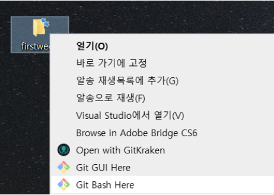


Git을 설치할 때 함께 설치된 것중에 Git Bash가 있었는데요, 아래에 궁금하신 분들을 위해서 Git Bash에 대해 설명을 써 놓았습니다.

<details><summary> Git Bash란? </summary>
    Git Bash는 window에서도 리눅스 체제의 명령어를 쓰기 위한 도구입니다.
    Bash는 유닉스에서 사용하는 커맨드 셸의 일종입니다. 커맨드 셸이라는 것은 사용자의 특정 명령어를 받아 운영체제한테 전달하는 역할을 하는 것을 의미해요.
    Git Bash를 이용해서 Github과 연동하는 것이 다른 GUI툴보다는 조금 복잡할 수 있지만 Git의 기본을 알기 가장 좋은 방법이기 때문에 Git Bash를 사용할 것입니다.</details>

Git Bash Here을 클릭하시면 다음과 같이 창이 뜹니다. 해당 폴더위치에서 Visual Studio Code를 실행시켜주기 위해 다음과 같이 입력합니다.

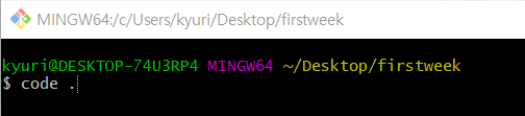


```
$ code .
```


#### VS Code 터미널 bash로 설정하기

1. `Ctrl` + `Shift` + `P` 를 눌러  command palette를 열기
2. Type - Select Default Shell 클릭
3.  옵션에서 Git Bash 선택
4.  `ctrl` + ` 를 눌러 터미널 열기
5.  터미널 창에서  ` + ` 아이콘 누르기
6. 터미널이 bash로 설정되었습니다!!


#### 가상환경 실행

가상환경은 개발을 하는데 있어서 아주 필수적인 부분입니다.


가상환경을 사용하는 가장 대표적인 이유로는 Python 모듈에 따른 충돌이라고 할 수 있습니다. 프로젝트마다  사용하는 Python 모듈과 환경이 다른데, 이 모든 설정들을 로컬에 저장하고 관리를 한다면 언젠가 알 수 없는 충돌이 일어나는 경우가 생길 수 있습니다.

이를 대비해서 각 프로젝트별로 별개의 가상환경을 만들어서 하나의 프로젝트만의 Python 환경을 만들어주는 것입니다.

또 다른 이유에는 관리의 용이성이 있습니다. 가상환경을 설치한 후 작업을 하다가 해당 환경이 필요 없어지면 가상환경에 해당하는 폴더만 삭제하면 되기 때문에 환경 관리가 편리해집니다.


가상환경에는 여러종류가 있는데 저희는 이 중에서 venv에 해당하는 것을 사용할 것입니다. 

가상환경을 실행하는 명령어는 다음과 같습니다.

```bash
$ python -m venv [가상환경이름]
```

이 명령어를 실행하면 설정한 가상환경이름으로 가상환경 폴더가 생성되는 것을 확인할 수 있습니다. 저는 여기서 가상환경이름을 myvenv라 설정하겠습니다.

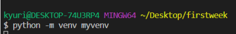


이제 이 가상환경을 활성화 시켜야겠죠?

```bash
$ source myvenv/Scripts/activate
```

mac 의 경우 Scripts 대신 bin을 사용합니다.

```bash
$ source myvenv/bin/activate
```

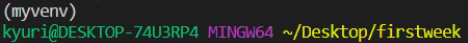


다음과 같이 위에 (myvenv)가 뜬 것을 확인할 수 있습니다! 가상환경이 활성화 되었다는 의미입니다.

#### Django 설치

가상환경을 실행 시킨 후 Django를 설치합니다.

python에는 pip이라는 명령어가 있는데, 파이썬 관련 패키지를 설치하는데 사용하는 명령어 입니다. 

```bash
$ pip install django
```

Django 설치가 완료되었습니다!


### 5. Django 'Hello World'

이제 모든 코딩의 기본인 Hello World를 Django에서 띄워볼까요??

사실 Django를 다루기전에 Django의 기본인 MTV 패턴에 대해서 배워야하는데  이에 대한 설명은 2주차에서 본격적으로 하겠습니다. 이번주에는 간단히 띄워보이는 것에 의의를 두자구요~!

#### 프로젝트 생성

```bash
$ django-admin startproject [프로젝트 명]
```

우선 Django를 실행하기 위해서는 프로젝트가 있어야 합니다. 저는 firstproject라는 이름으로 프로젝트를 만들겠습니다.

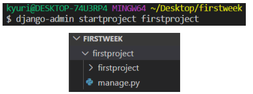


지금 보면 firstproject안에 firstproject와 manage.py가 있는 것이 보이죠?  이 manage.py의 위치를 꼭 기억하시기 바랍니다.

#### 앱 생성

프로젝트를 생성했으면 앱을 만들어야 합니다. 이 때 앱은 manage.py와 같은 위치에 생성을 해줘야해요. 이 manage.py에 대한 설명은 2주차 때 더 설명해드리도록 하겠습니다.

현재 폴더에서 하위 폴더로 들어갑니다.

```bash
$ cd firstproject
```

그 후 아래 명령어를 통해 앱을 생성합니다. 저의 앱이름은 firstapp으로 하겠습니다.

```bash
$ python manage.py startapp [앱 이름]
```

<details><summary> 프로젝트 & 앱이란 </summary>
    Projects<p>
    - 웹사이트의 어플리케이션들과 그 구성의 집합 <p>
    - 여러개의 앱들을 포함 <p>
    Apps<p>
    - 어떤 기능을 하는 웹 어플리케이션<p>
    - 하나의 앱은 모듈처럼 사용할 수 있기에 여러개의 프로젝트에 속할 수 있음
    </details>

프로젝트 폴더와 앱 폴더의 하위 항목들을 살펴보면 굉장히 다양한 폴더/파일들이 있는 것을 확인할 수 있습니다. 이에 대한 상세 사항은 진행하면서 차근차근 알려드리고 배워나갈 예정입니다.

#### Hello World를 만들기 위한 순서

우선 마구잡이로 코딩을 하기전에 Hello World를 띄우는 장고의 순서를 머리에 박아놓으면 훨씬 좋습니다.

1. <프로젝트>settings.py⇒ project에게 app의 존재 알리기
2. <앱>templates ⇒ views.py에서 처리된 데이터를 받아 사용자에게 화면을 보여줌
3. <앱>views.py ⇒ 데이터를 처리하는 함수 작성
4. <프로젝트>urls.py ⇒ 요청에 맞는 함수를 views.py에서 찾아 요청 전달


##### 1. Settings.py에 app의 존재 알리기

Settings.py는 프로젝트의 전체 설정 (호스트, DB, 앱, 디버깅 etc...)을 위한 공간입니다. 원하는 내용을 웹에 띄우기 위해서는 우리가 만든 앱과 프로젝트를 연결시켜주어야 하는데, 그 연결의 역할을 하는게 settings.py입니다.

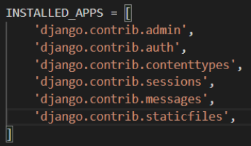


settings.py의 INSTALLED_APPS에 '내가 앱을 만들었어!'라고 밝혀주어야 합니다. 

```
'[앱이름].apps.[앱이름]Config',
```

여기서 중요한건 Config앞에 앱이름을 작성 시 첫글자를 대문자로 해야하는 것입니다.

저의 앱이름은 firstapp이니까 'firstapp.apps.FirstappConfig', 이런 식이 되겠죠??


##### 2. 유저에게 보이는 화면인 Template만들기

우선 앱 폴더 안에 templates 폴더를 만듭니다. 그 후 templates 폴더 안에 앱 이름을 가진 폴더를 만들고 그 하위에 html파일을 만듭니다.  바로 이 html에 hello world를 작성해주시면 됩니다.

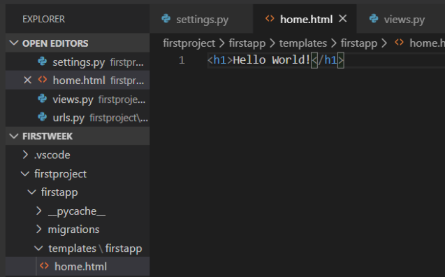


이런 질문이 나올 수 있어요.

" 왜 templates폴더 안에 바로 html파일을 만드는게 아니라 굳이 templates폴더 안에 앱이름의 폴더를 하나 만들고 그 안에다 html파일을 만드나요???"

우선 Django 개발 가이드라인에서는 위와 같이 행동하는것을 권장하고 있습니다. 그 이유는 프로젝트 안에 앱이 여러개일 때, 만일 복수의 앱들이 같은 이름의 템플릿을 가진 경우 오류가 날 수 있기 때문입니다.

예시를 들어보자면 App1에 home.html이 있고, App2에 home.html이 있는 경우, App2의 views.py에서 home.html을 가져오라고 요청했을 때 App1의 home.html을 가져오게 됩니다.

그 이유는 템플릿을 찾을 때 본인 앱안의 템플릿을 먼저 가져오는게 아니라 전체 앱들의 템플릿 폴더들을 처음부터 훑으면서 가져오기 때문입니다. 이럴 경우 templates폴더 안에 앱 이름의 폴더를 하나 생성하여 밝힘으로써 View에 "App2/home.html" 과 같이 템플릿 명을 지정하게 하여 혼동을 없앨 수 있습니다.  

##### 3. html의 내용을 보여달라는 요청이 들어오면 home.html을 열어주는 함수를 작성하기 

함수를 작성하는 부분은 views.py라고 생각하시면 쉬울거에요. 제목에서 말했듯이 html보여줘!!라는 요청이 들어오면 앱 안의 home.html을 열어주는 함수를 작성하겠습니다.

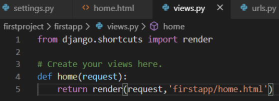


여기서 사실 가장 중요한건 request와 render의 개념입니다.

render의 역할은 사용자의 요청(request)이 들어왔을 때 템플릿 (ex. html)을 불러오는 역할입니다.

```
render(request, template_name, context=None, content_type=None, status=None, using=None)
```

render는 다음과 같은 매개변수를 가지는데 template_name은 위에서 쓴 것처럼 내가 반환할 템플릿 명입니다. 

context는 view에서 사용하는 파이썬 변수를 html 템플릿으로 넘길 때 사용하게 됩니다. 

예를 들면

```python
def home(request):
    address = "a"
    return render(request,'firstapp/home.html',{'address':address})
```

home이라는 함수에서 사용한 address변수를 html템플릿으로 넘겨서 사용하고 싶을 때 다음과 같이 작성하게 됩니다. 

> 추후에 render와 redirect라는 개념에 대해서 반드시 알아야 할 상황이 옵니다.  이 내용이 필요할 때 더 자세히 설명드리도록 하겠습니다.

##### 4.  urls.py에서 주소 형태와 불러올 함수 지정하기

urls.py에서는 말그대로 url에 대한 내용을 다루게 됩니다. 여기서는 Django를 실행시켰을 때 firstapp의 view에서 만든 home 함수를 불러와라  라고 시킬겁니다. 

home 함수는 요청이 들어왔을 대 home.html을 열어주는 함수이므로 Django를 실행시켰을 때 home.html 내의 Hello World가 보이겠죠??

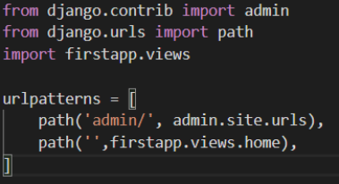


여기서 주의해야할 것은 바로 import 입니다.  내가 firstapp에 있는 view를 참조할거야 라고 밝혀줘야 Django가 이를 알아듣고 사용할 수 있기 때문이죠.


여기까지가 끝입니다. 어때요, 좀 복잡한가? 싶으면서도 사실 간단하죠??

이걸 이제 두눈으로 확인해야하니 장고를 실행시켜봅시다.


```bash
$ python manage.py runserver
```

-> 주의 : 반드시 manage.py가 있는 폴더에서 해당 명령어 치기

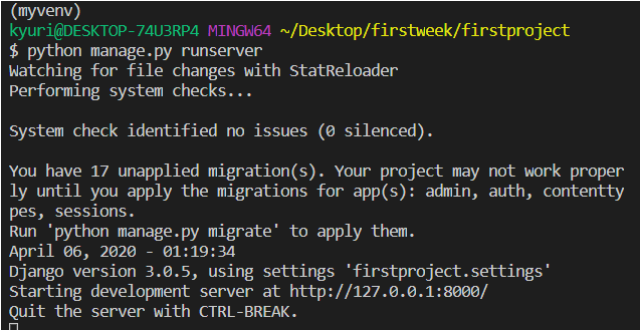


쨔란 ~~~ 저기 Starting development server at http://127.0.0.1:8000/ 이라는게 보이죠?  해당 url은 장고의 개발 url 입니다.

저 http://127.0.0.1:8000/에 마우스를 갖다대고 `ctrl `+ 좌클릭을 하면 장고 화면을 확인할 수 있습니다.


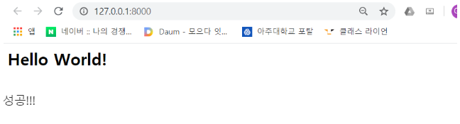


성공!!! 


### 4 Github : 분산 버전 관리 툴인 깃을 사용하는 프로젝트를 지원하는 웹호스팅 서비스
